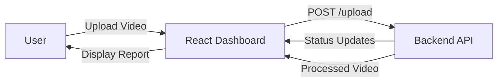

# Cricket Pose Estimation - Frontend

A professional React + TypeScript dashboard for analyzing cricket batting and bowling techniques using AI-powered biomechanics.

## 🏏 Project Overview
This frontend application provides a modern, interactive interface for cricketers and coaches to upload footage and receive instant biomechanical feedback. It features:
- **Dark Mode UI**: Built with Tailwind CSS v4 for a premium aesthetic.
- **Real-time Status**: Live polling of backend analysis progress.
- **Video Playback**: H.264 compatible player with skeletal overlays.
- **AI Reports**: Displays comprehensive biomechanical insights generated by the backend.

## 🏗️ Architecture Flow



## 🚀 Getting Started

### Prerequisites
- Node.js (v18 or higher)
- npm or yarn

### Installation
1. Clone the repository:
   ```bash
   git clone https://github.com/ShreyashPatil530/Cricket-Pose-Estimation-Frontend.git
   ```
2. Navigate to the directory:
   ```bash
   cd Cricket-Pose-Estimation-Frontend
   ```
3. Install dependencies:
   ```bash
   npm install
   ```

### Running the App
Start the development server:
```bash
npm run dev
```
The app will be available at `http://localhost:5173`.

## 🛠️ Tech Stack
- **Framework**: React 18 + TypeScript
- **Build Tool**: Vite
- **Styling**: Tailwind CSS v4
- **State Management**: React Hooks
- **Icons**: Lucide React
- **HTTP Client**: Axios

## 📂 Project Structure
```
src/
├── components/    # Reusable UI components (Dashboard, etc.)
├── App.tsx        # Main application entry
├── main.tsx       # React DOM rendering
└── index.css      # Tailwind v4 configuration
```
